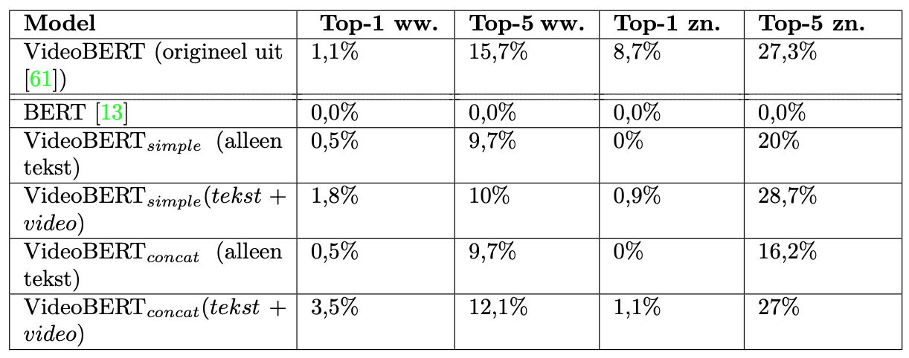
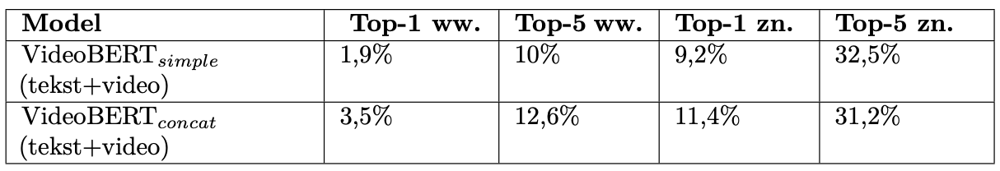
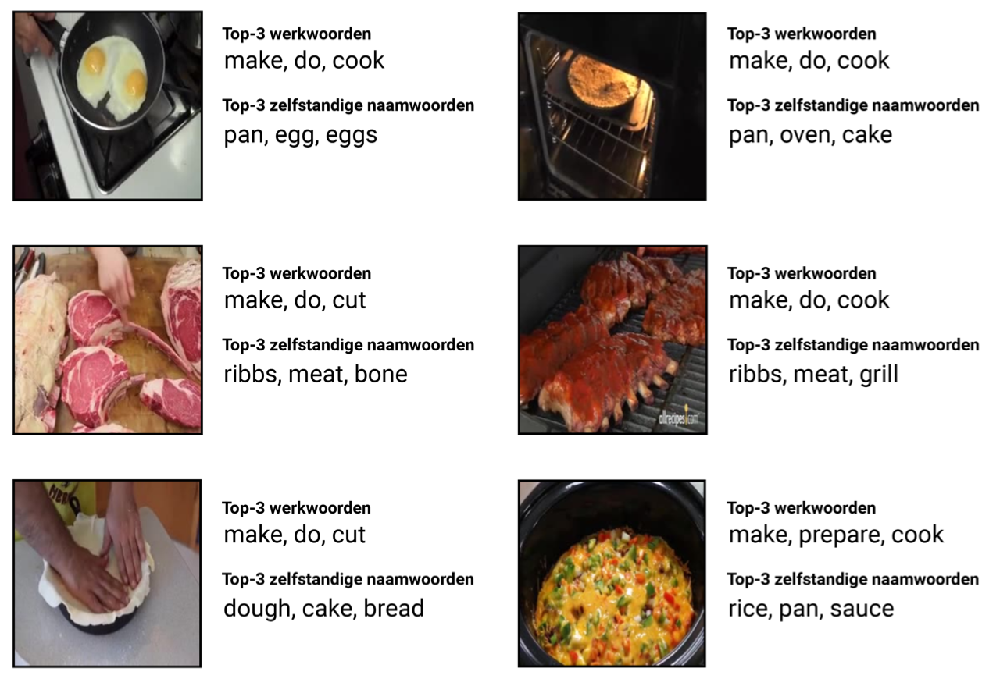

# Code voor masterproef
Deze repository bevat de code voor het project van mijn masterproef omtrent VideoBERT. De code in deze repository is gebaseerd op code van https://github.com/huggingface/transformers.

## Stap 1: Verzameling van de trainingsdata
In deze stap worden de videos en tekstannotaties verzameld uit de HowTo100M dataset. Het bestand ***stap1/ids.txt*** bevat alle ids van de 47470 videos die opgenomen werden in de trainingsdata. De annotaties kunnen worden geraadpleegd via https://www.rocq.inria.fr/cluster-willow/amiech/howto100m/.

## Stap 2: Transformatie van de data
In deze stap worden de videos getransformeerd door de frame rate aan te passen naar 10 fps en aan de tekst interpunctie toe te voegen. Voor de tekst kunnen de getrainde modellen voor interpunctie worden geraadpleegd via https://drive.google.com/drive/folders/0B7BsN5f2F1fZQnFsbzJ3TWxxMms.

## Stap 3: Extractie van de I3D kenmerken
De I3D kenmerken van de videos worden in deze stap geconstrueerd a.d.h.v. het I3D netwerk. De folder ***stap3/checkpoint*** bevat het originele Tensorflow checkpoint voor het I3D model.

## Stap 4: Clustering van de I3D kenmerken
In deze stap worden de I3D kenmerken gegroeppeerd a.d.h.v. hïerarchische k-means. De beste resultaten werden bekomen wanneer ***k=12*** en ***h=4***.

## Stap 5: BERT omvormen tot VideoBERT
Het startpunt van VideoBERT is het BERT model. De ***state_dict*** van het getrainde BERT model kan in ***Pytorch*** aangepast worden om rekening te houden met de nieuwe woordenschat.

## Stap 6: Training van het model
In de laatste stap werd het model getraind. Hierbij werd er zowel gëexperimenteerd met een model dat geen rekening houdt met de nieuwe voorgestelde aligneringstaak, alsook een model dat hier wel rekening mee houdt.

# Evaluatie
Voor de evalutie van het model werd de YouCookII validatie dataset gebruikt. Het getrainde model behaald gelijkaardige resultaten als het oorspronkelijke model op een zero-shot classificatietaak. De lijsten voor de werkwoorden en zelfstandige naamwoorden kunnen worden teruggevonden in ***evaluatie/verbs.txt*** en ***evaluatie/nouns.txt***. Het bestand met de ground-truth YouCookII linguïstieke en visuele zinnen samen met de werkwoorden en zelfstandige naamwoorden kan worden teruggevonden op https://drive.google.com/file/d/1hxbiS3mrQdJLkXsPo23dwl4m-dnCMcfV/view?usp=sharing.

### Resultaten met Originele Template Zin

### Resultaten met Aangepaste Template Zin

### Kwalitatieve Resultaten

#### Tekst-naar-Video taak

#### Video-naar-Tekst taak

# Praktische problemen
Enkele belangrijke praktische problemen die ervaren werden tijdens het implementatieproces:
  - Enorme vereist opslagcapaciteit voor de trainingsdata (videos+tekst)
  - Zeer veel rekenkracht nodig (in termen van GPUs), in dit geval werd 1 Cloud Tesla V100 GPU gebruikt
  - Batch size groot genoeg houden door technieken zoals gradient accumulation

# Belangrijke bevindingen
  - Performantie van het model blijkt redelijk afhankelijk te zijn van de gebruikte template zin, wat een mogelijke tekortkoming is
  - De multimodale aard van het model lijkt wel degelijk een semantische correspondentie te leren tussen tekst en video (vergeleken met bv. alleen tekst)

# Bronnen
De belangrijkste bronnen zijn:
  - VideoBERT paper: https://arxiv.org/pdf/1904.01766.pdf
  - HuggingFace: https://github.com/huggingface/transformers
  - I3D model: https://github.com/deepmind/kinetics-i3d
  - RevoScaleR: https://docs.microsoft.com/en-us/machine-learning-server/r-reference/revoscaler/revoscaler
  - FFmpeg: https://ffmpeg.org/
  - Youtube-dl: https://youtube-dl.org/
  - HowTo100M data: https://www.rocq.inria.fr/cluster-willow/amiech/howto100m/
  - YouCookII: http://youcook2.eecs.umich.edu/
  - Punctuator2 repository: https://github.com/ottokart/punctuator2
  - punctuator module: https://pypi.org/project/punctuator/
